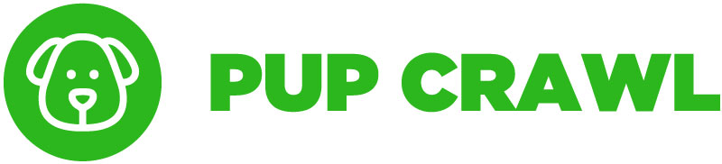

Pup Crawl is a web app for fostering dog (and people) socialization. Owners check in their dogs and can leave messages for others to see.

Try out our beta site now: https://stormy-bayou-84186.herokuapp.com/

This  web app is powered by:
   - Node.js, Express Server, MySQL, Sequelize ORM, Firebase, Handlebars
   - Mocha and Chai testing
  
Pup Crawl is currently in limited release but plan on rolling out more features in the coming months.

Additional features include:
  - User login
  - Additional input validation
  - Authentication
  - Geolocation for park check-in
